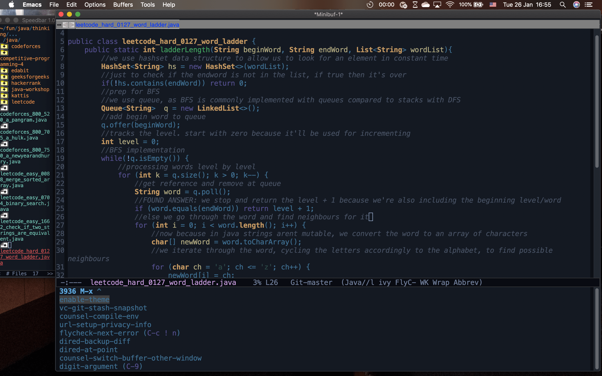

<h1>Thinking</h1>

A project of mine to develop my computational thinking. For this one, I am focusing on the algorithmic side of computational thinking, and had thus started going through algorithmic programming problems to sharpen it. I mostly did my work in Java, and some in C++ to study it. I found it to be a great way to learn some built in functions in the language, such as those for parsing.

If you go through my code, you'd notice that plenty of them have comments detailing what is happening, my thinking at the time, and things I've learned from doing the problem. Some even have comments for every line of code like the screenshot from the thumbnail. It is ugly to look at but those are purely for my learning benefit

<h2>Link(s)</h2>

code: <a href="https://github.com/johnamata/thinking">github.com/johnamata/thinking</a>

<h2>Pics</h2>

HD version of the thumbnail from project page, a screenshot from jan 26, 2021:

